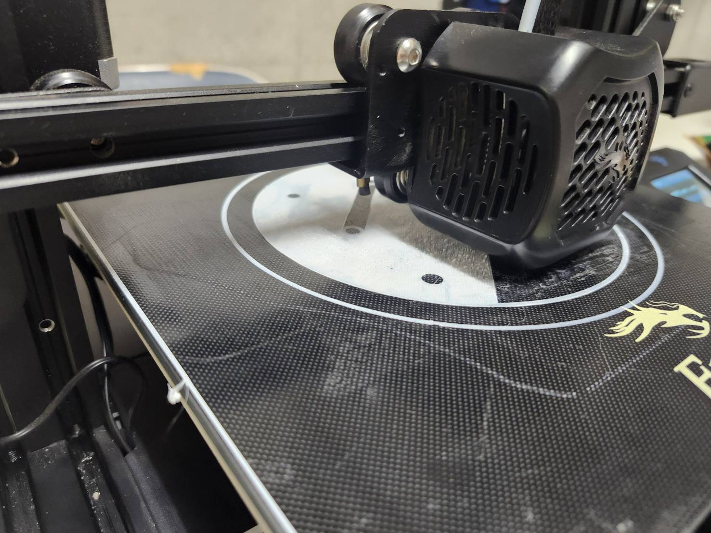
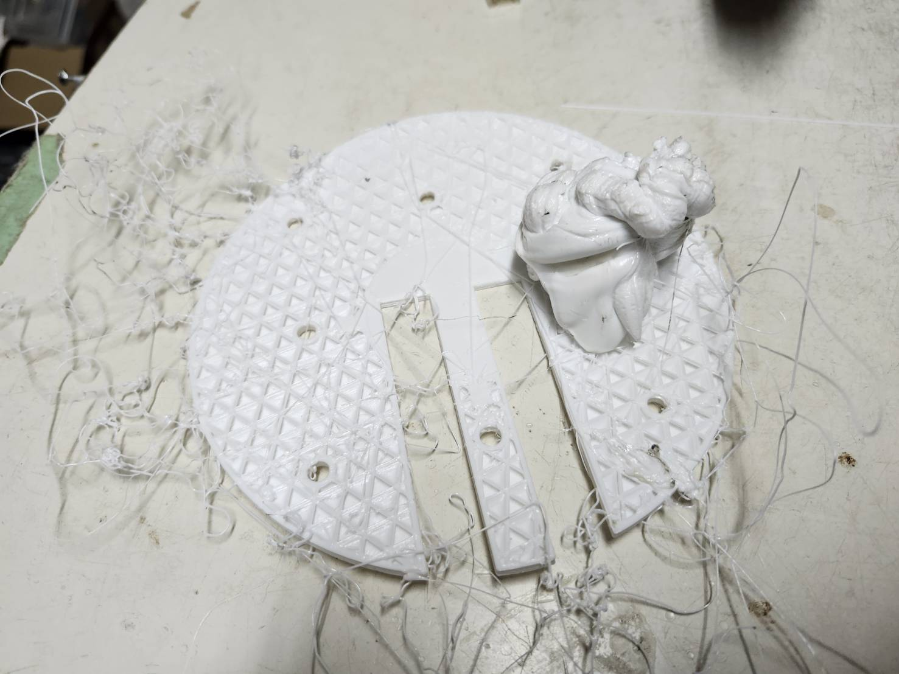
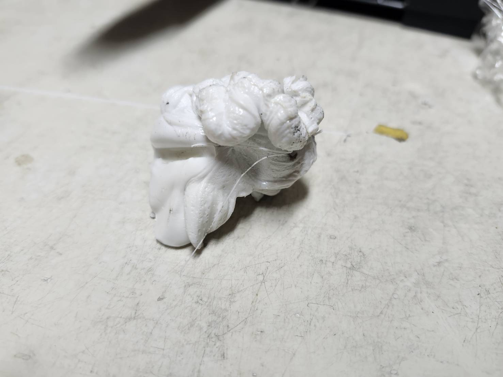
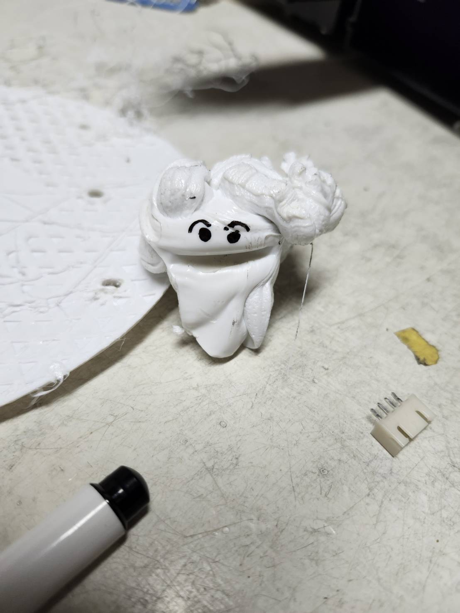

　こんにちは。ロボットクリエイターズです。

　先日新入生に向けた３Dプリンターの使い方講習がありました。先輩にセットの仕方から、スライサーの使い方まで丁寧に教えてもらっていました。

　一通り終わったあと、実際に部品を吸ってみたときに事件が...。セットをし。データを3Dプリンターに送り、一層目が無事に刷られているのをか確認しました。 もう時間は遅かったのでみんな帰宅し、翌日に部品を取りに行くことにしました。

　翌日、Teamsに一つの連絡が来ました。「印刷失敗してます」。二つの画像が添付されていました。

おそらくヒート別途が少し傾いており、途中で樹脂が大変なことになっていました。

　次は設定を慎重にやります！失敗して、学んでいけるのは今のうちです。キャチロボコンテストに向けて、製作頑張っていきます！！

