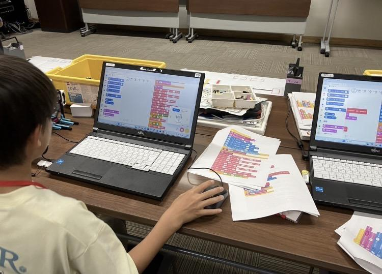

毎週火曜日、プラチナ未来スクールでロボット教室を開催しています。
 
教室では、子どもたちが説明書を見ながらロボットを組み立て、完成した後はプログラミングをして実際に動かします。ロボットが思い通りに動くと「できた！」と嬉しそうに喜び、何度も動かして楽しんでいる姿が見られます。
 
その一方で、組み立てを間違えてしまったり、プログラムがうまく動かなかったりすると、悔しそうにしたり、少しイライラしてしまったりすることもあります。しかし、コーチと一緒に原因を考えながら少しずつ修正していくことで、最後には自分の力で完成させることができています。
子どもたちが試行錯誤しながら挑戦し、完成したロボットを嬉しそうに動かしている姿を見ると、ものづくりの楽しさや、最後まで諦めずに取り組むことの大切さを改めて感じます。
 
毎週、それぞれの子どもたちの成長や新しい発見を見ることができ、私たちスタッフも元気をもらっています。これからも、子どもたちが楽しく学び、自信を持って挑戦できる教室づくりを続けていきたいと思います。
